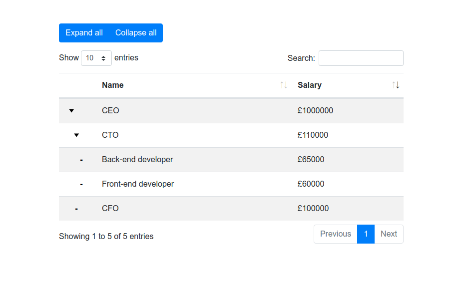

# TreeTables plug-in for jQuery 

[](https://travis-ci.com/reside-ic/TreeTables?branch=master)
[](https://codecov.io/github/reside-ic/TreeTables?branch=master)

TreeTables is a jQuery plugin that enhances the functionality of the
popular [DataTables](https://github.com/DataTables/DataTables) plugin.

DataTables does not support tree data by default, so this plugin adds
that support.

Please note that TreeTables does *not* support server-side processing.



## Installation options
1. Download:
    First download the base DataTables scripts here: https://datatables.net/download/
    Then also download this repo and include the following scripts on your page:

    ```
    <script type="text/javascript" src="DataTables/datatables.min.js"></script>
    <script type="text/javascript" src="treeTable.js"></script>
    ```

    And the following css in your document head:
    ```
    <link rel="stylesheet" type="text/css" href="DataTables/datatables.min.css"/>
    <link rel="stylesheet" type="text/css" href="tree-table.css"/>
    ```

    See [examples](examples/README.md) for styling with Bootstrap

2. npm: `npm install treetables`

## Basic Usage

```
 const organisationData = [
            {tt_key: 1, tt_parent: 0, name: "CEO"},
            {tt_key: 2, tt_parent: 1, name: "CTO"},
            {tt_key: 3, tt_parent: 2, name: "developer"},
            {tt_key: 4, tt_parent: 1, name: "CFO"}
        ];

        $('#my-table').treeTable({
            "data": myData,
            "columns": [
                {
                    "data": "name"
                }
            ]
        });
```

Data provided to the table must include the following fields:
* tt_key: number - a unique row identifier. Must be 1-indexed.
* tt_parent: number - the key of this row's parent row

## Options
TreeTable options are most DataTable options plus:
* collapsed: bool - whether to start with all child rows collapsed

```
        $('#my-table').treeTable({
            "data": myData,
            "collapsed": true,
            "columns": [
                {
                    "data": "name"
                }
            ]
        });
```

Please note that the TreeTable plugin adds a left-hand column to the table.
This means that **user provided columns are 1-indexed instead of 0-indexed**.

E.g., this table will be initially sorted by name:


```
        $('#my-table').treeTable({
            "data": myData,
            "columns": [
                {
                    "data": "name"
                },
                {
                    "data": "salary"
                }
            ],
            "order": [[ 1, 'asc' ]]
        });
```


## API
The DataTables API will be attached to the table element in the usual way,
accessible by ```$('#my-table').DataTable()```

Please note that as with the options, columns are 1-indexed. E.g. to re-sort the
above table by salary:

     $('#my-table').DataTable()
                   .order([ 2, 'asc' ])
                   .draw();


Additionally the TreeTable plugin exposes API methods for collapsing and
 exanding rows via ``` $('#myTable').data('treeTable')```

To expand all rows:

    $('#myTable').data('treeTable')
                    .expandAllRows()
                    .redraw();

To collapse all rows:

    $('#myTable').data('treeTable')
                    .collapseAllRows()
                    .redraw();

## Ajax data sources
TreeTables has minimal support for ajax data sources. The `ajax` option can be used as per the
[DataTables documentation](https://datatables.net/reference/option/ajax), but it does *not* support server-side processing,
 and it does *not* support the ajax related API methods: `ajax.json()`, `ajax.reload()`, `ajax.url()`

## Examples
See [examples/README.md](examples/README.md)

### Thanks
This plugin was inspired by a [jsfiddle](http://jsfiddle.net/hcke44hy/8)
posted by a user called Mytko in the datatables forum:
https://datatables.net/forums/discussion/25045/treetable-in-datatables
